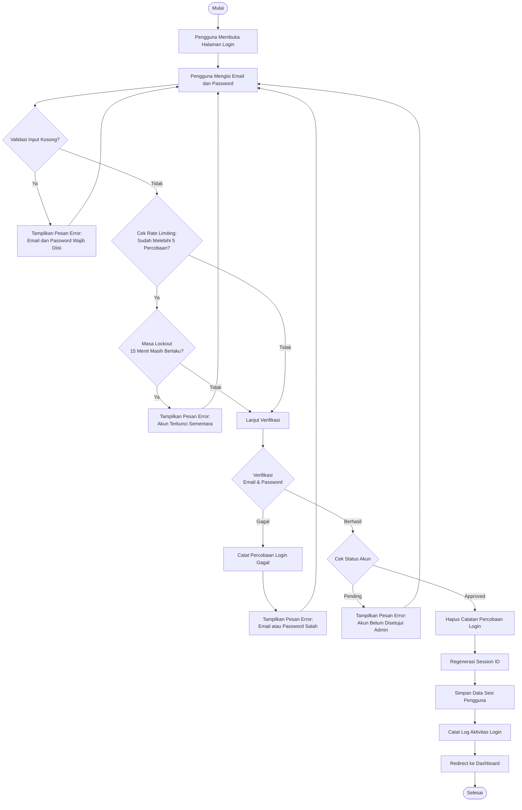
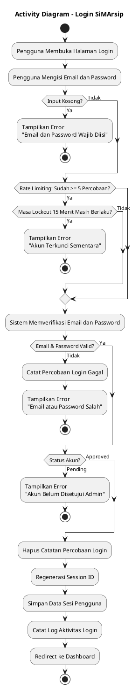
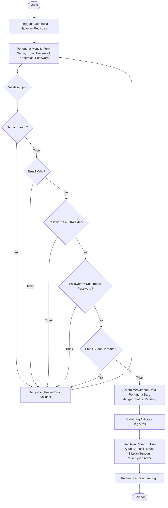
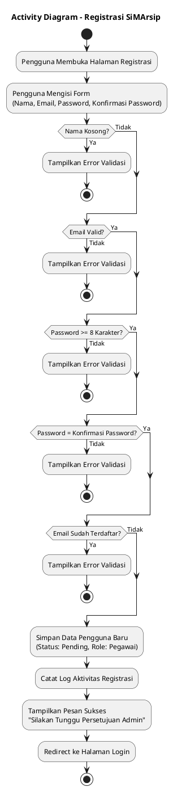
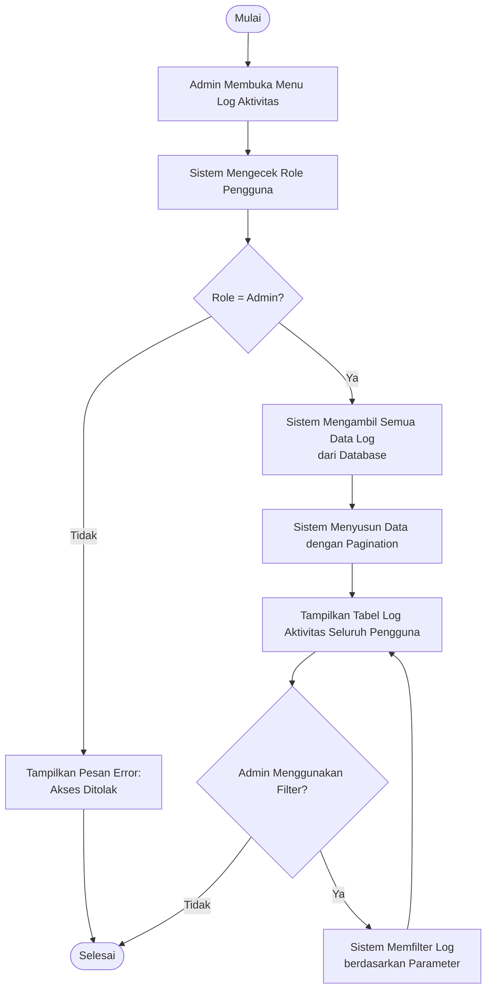
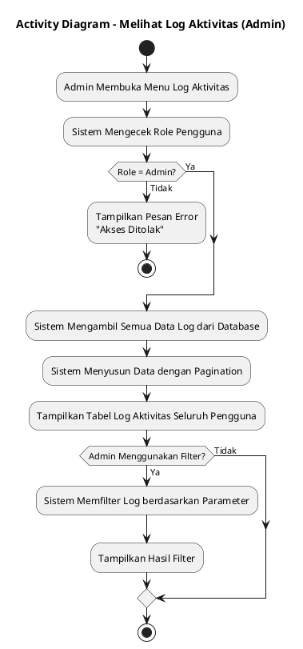
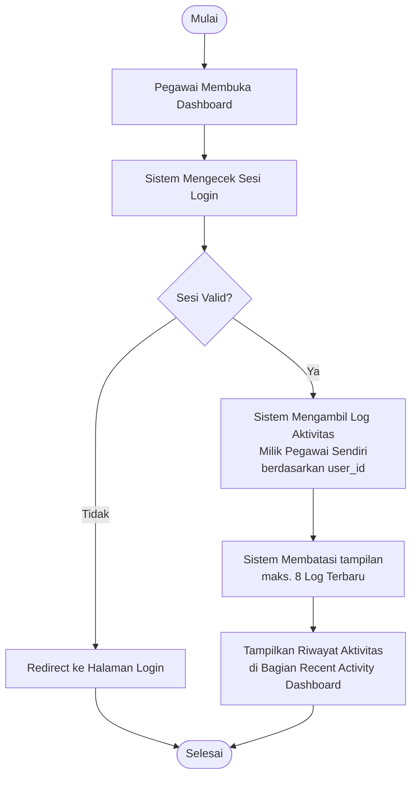
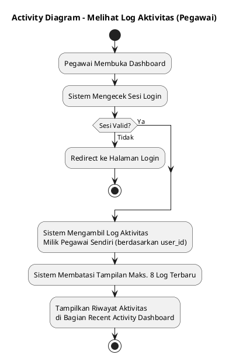

# Activity Diagram - SiMArsip

## 1. Activity Diagram: Login

### PlantUML: Login

---

## 2. Activity Diagram: Registrasi

### PlantUML: Registrasi

---

## 3. Activity Diagram: Melihat Log Aktivitas (Admin)

### PlantUML: Melihat Log Aktivitas (Admin)

---

## 4. Activity Diagram: Melihat Log Aktivitas (Pegawai)

### PlantUML: Melihat Log Aktivitas (Pegawai)

