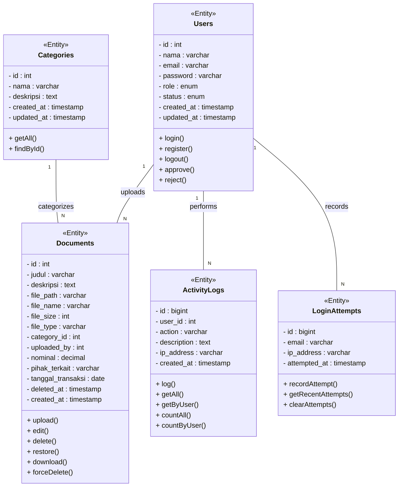
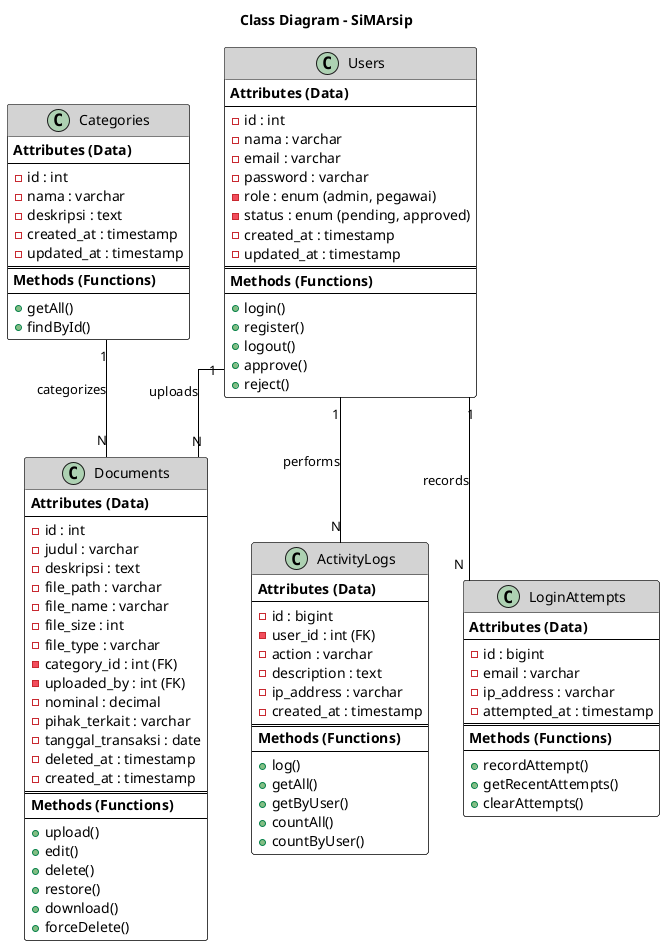

# Class Diagram - SiMArsip

Diagram ini menggambarkan struktur class pada Sistem Informasi Manajemen Arsip, meliputi atribut data dan method yang dimiliki setiap class beserta relasi antar class.

---

### PlantUML: Class Diagram

