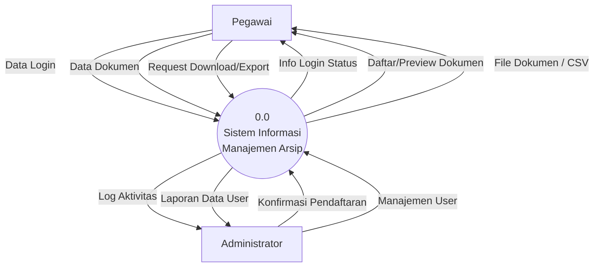
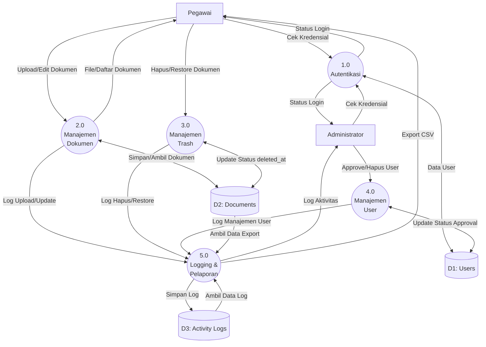

# Data Flow Diagram (DFD) - SiMArsip

Dokumen ini menjelaskan aliran data dalam Sistem Informasi Manajemen Arsip (SiMArsip).

## DFD Level 0 (Context Diagram)

DFD Level 0 atau Diagram Konteks memberikan gambaran besar interaksi sistem dengan entitas luar.

---

## DFD Level 1

DFD Level 1 merinci proses utama yang terjadi di dalam sistem dan interaksinya dengan penyimpanan data (Data Store).

## Penjelasan Singkat

1.  **D1: Users**: Menyimpan data akun pegawai, termasuk status approval oleh admin.
2.  **D2: Documents**: Menyimpan metadata dokumen (judul, deskripsi, nominal, dll) dan path file fisik.
3.  **D3: Activity Logs**: Mencatat setiap aksi penting (Login, Upload, Edit, Delete) untuk keperluan audit.
4.  **Soft Delete**: Proses hapus dokumen (P3) tidak langsung menghapus dari database, melainkan memperbarui kolom `deleted_at`.
