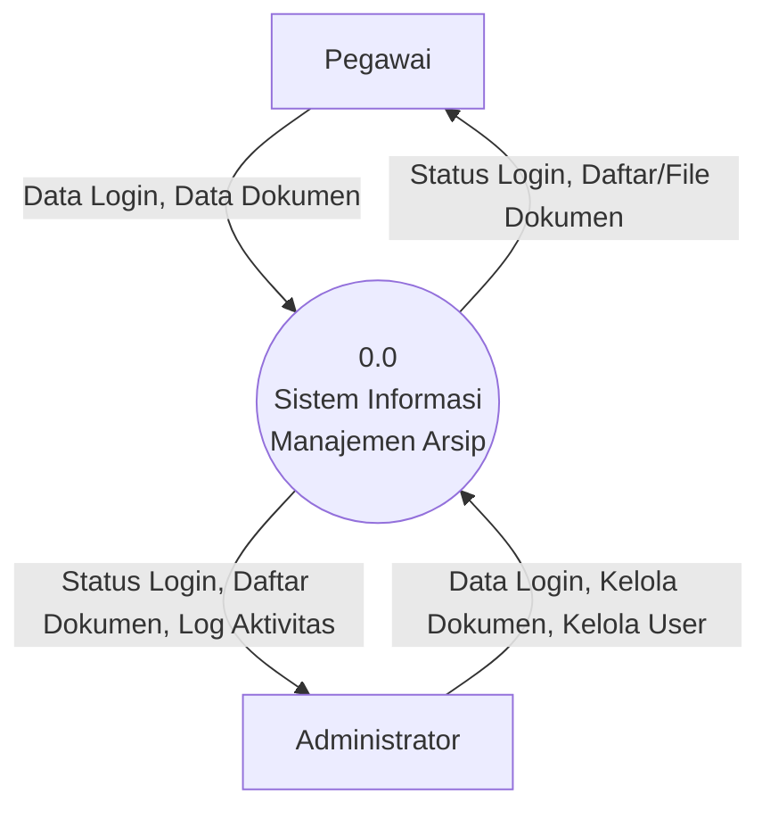
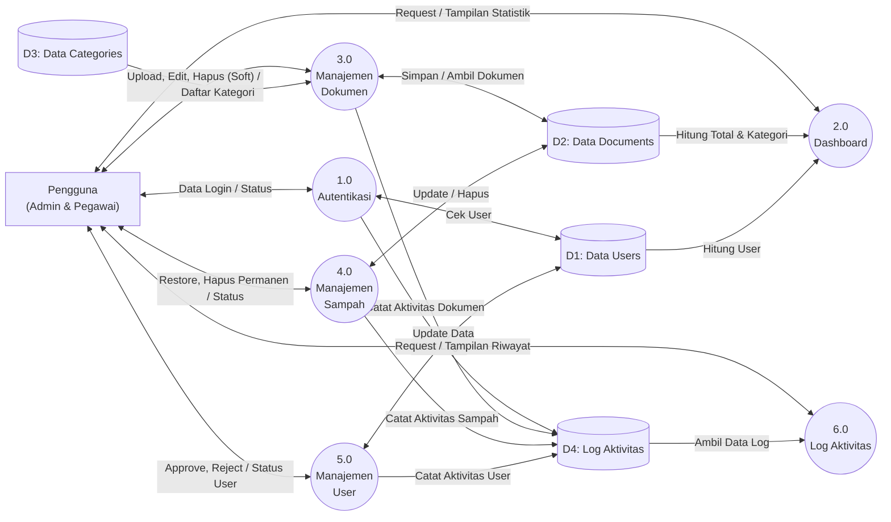
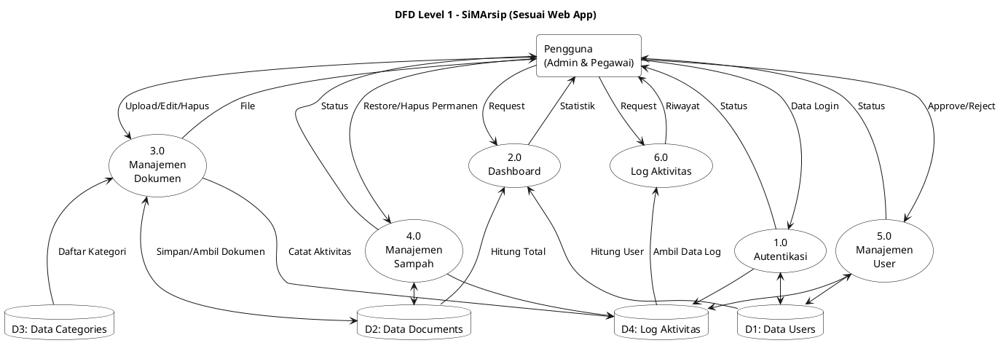

# Data Flow Diagram (DFD) - SiMArsip

Dokumen ini menjelaskan aliran data dalam Sistem Informasi Manajemen Arsip.

---

## DFD Level 0 (Context Diagram)

---

## DFD Level 1

Mengikuti struktur asli web aplikasi SiMArsip, terdapat 6 proses utama dan 4 Data Store (`users`, `documents`, `categories`, `activity_logs`). Berikut adalah DFD Level 1 yang lebih akurat:

### PlantUML: DFD Level 1

