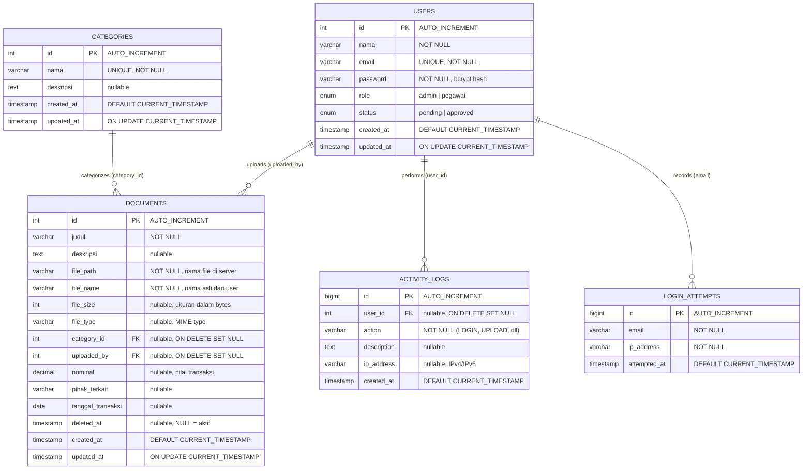
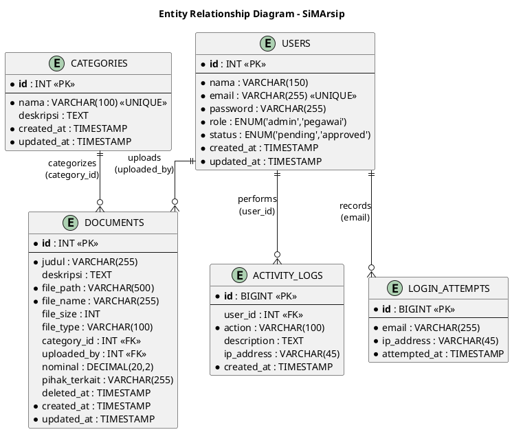

# Entity Relationship Diagram (ERD) - SiMArsip

Diagram ini menggambarkan struktur database dan relasi antar tabel pada Sistem Informasi Manajemen Arsip.

---

## ERD

---

### PlantUML: ERD

---

## Penjelasan Relasi

| Relasi | Tipe | Keterangan |
|--------|------|------------|
| **USERS → DOCUMENTS** | One-to-Many | Satu user dapat mengunggah banyak dokumen. FK: `uploaded_by` → `users.id`. ON DELETE SET NULL. |
| **USERS → ACTIVITY_LOGS** | One-to-Many | Satu user dapat memiliki banyak catatan log aktivitas. FK: `user_id` → `users.id`. ON DELETE SET NULL. |
| **USERS → LOGIN_ATTEMPTS** | One-to-Many | Satu email user dapat memiliki banyak catatan percobaan login. Relasi berdasarkan kolom `email`. |
| **CATEGORIES → DOCUMENTS** | One-to-Many | Satu kategori dapat mengelompokkan banyak dokumen. FK: `category_id` → `categories.id`. ON DELETE SET NULL. |

## Catatan Teknis

- **Soft Delete**: Dokumen yang dihapus tidak langsung hilang dari database, melainkan kolom `deleted_at` diisi timestamp. Jika `NULL` berarti dokumen masih aktif.
- **Rate Limiting**: Tabel `login_attempts` mencatat setiap percobaan login gagal. Setelah 5 kali gagal dalam 15 menit, akun terkunci sementara.
- **Cascade**: Semua foreign key menggunakan `ON UPDATE CASCADE` dan `ON DELETE SET NULL` agar data tetap konsisten saat user atau kategori dihapus.
