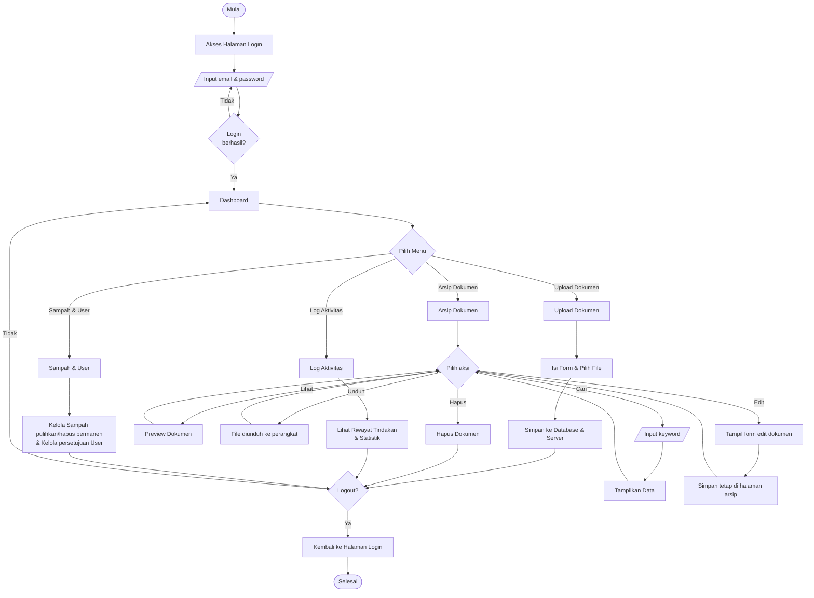

# Flowchart Sistem - SiMArsip

Dokumen ini berisi bagan alir (flowchart) utama yang menggambarkan logika perjalanan pengguna dari awal membuka aplikasi, memilih menu di Dashboard, hingga keluar dari sistem.

---

## Flowchart Program

Sesuai dengan format yang diinginkan, berikut adalah flowchart yang digabungkan menjadi satu kesatuan utuh (Mulai $\rightarrow$ Login $\rightarrow$ 3 Pilihan Menu $\rightarrow$ Logout).

### Penjelasan Singkat
1. **Mulai & Login**: Pengguna mengakses halaman login dan memasukkan email/password. Jika salah, kembali input. Jika benar, masuk ke Dashboard.
2. **Pilih Menu**: Dari Dashboard, alur terpecah menjadi 3 cabang menu utama:
   - **Upload Dokumen**: Untuk mengunggah dokumen baru.
   - **Arsip Dokumen**: Mengelola dokumen yang ada dengan opsi berulang (*Cari, Lihat, Unduh, Edit*) yang akan kembali ke "Pilih aksi". Memilih opsi *Hapus* akan menyelesaikan aksi di menu ini.
   - **Sampah & User**: (Khusus Admin) untuk mengelola data terhapus dan akun pegawai.
3. **Logout**: Setelah melakukan aksi, sistem menanyakan apakah ingin Logout. Jika "Tidak", kembali ke Dashboard. Jika "Ya", sesi berakhir dan selesai.
