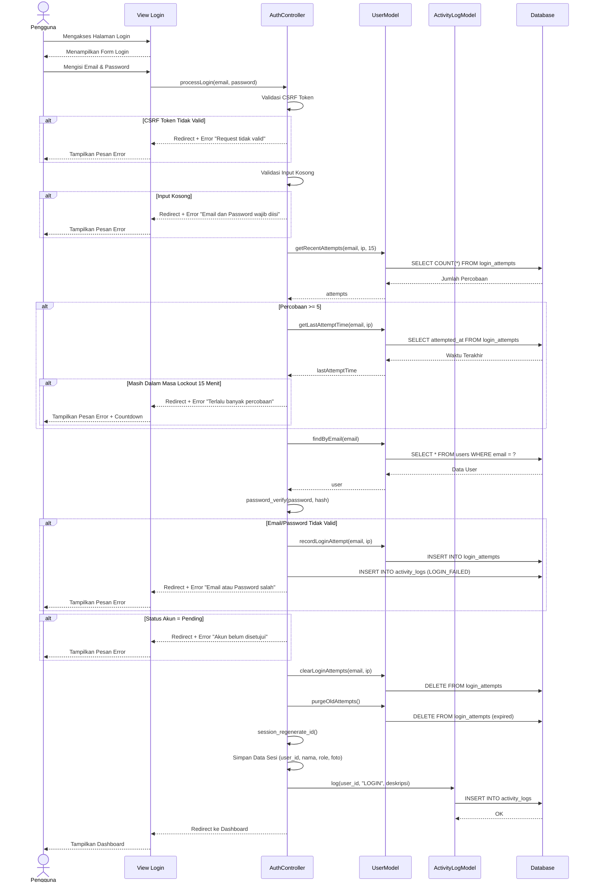
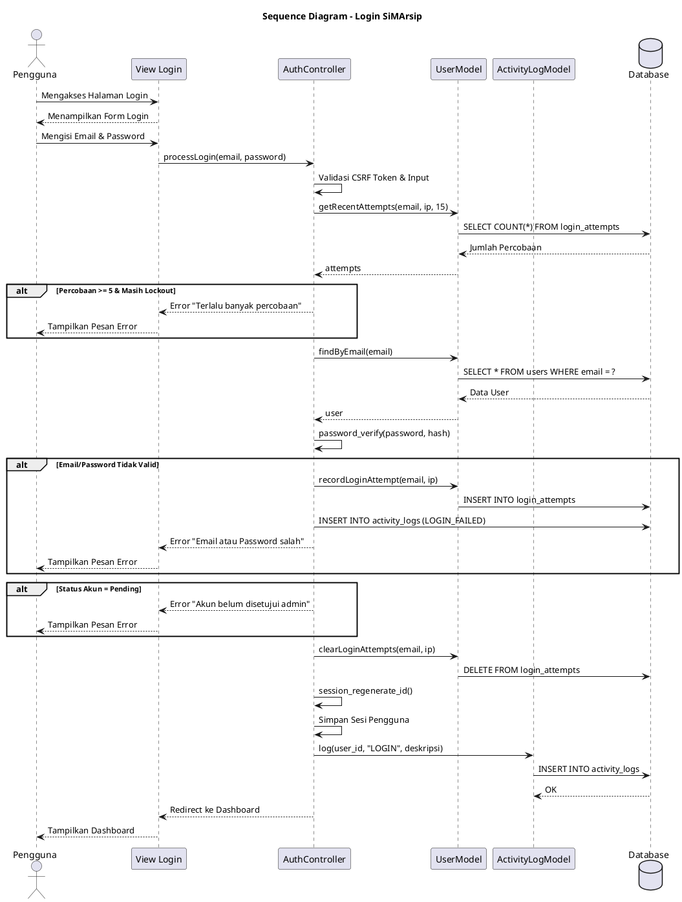
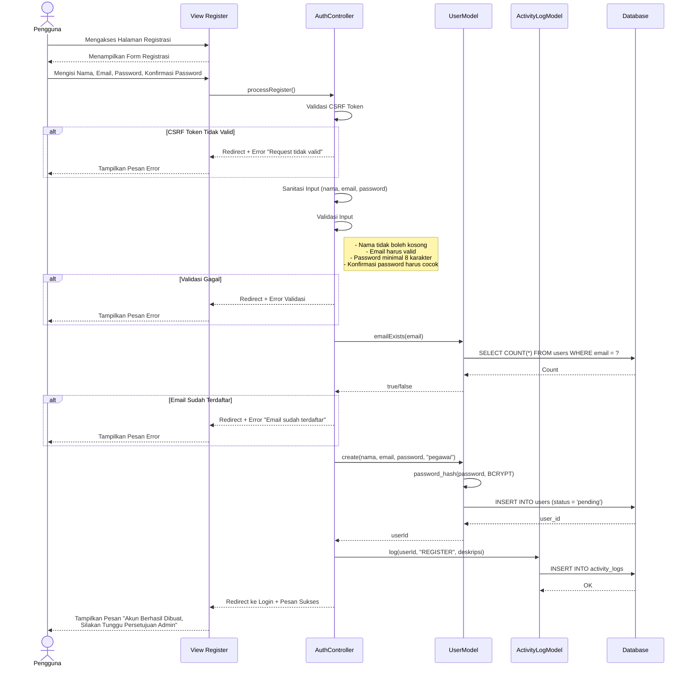
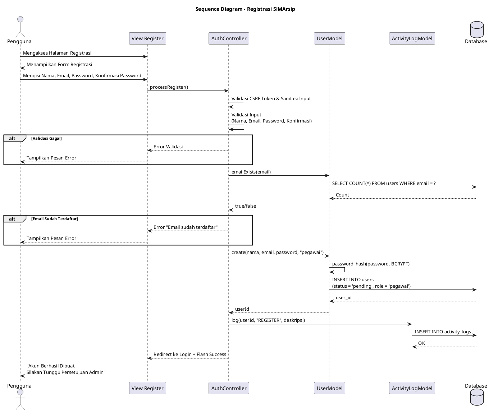
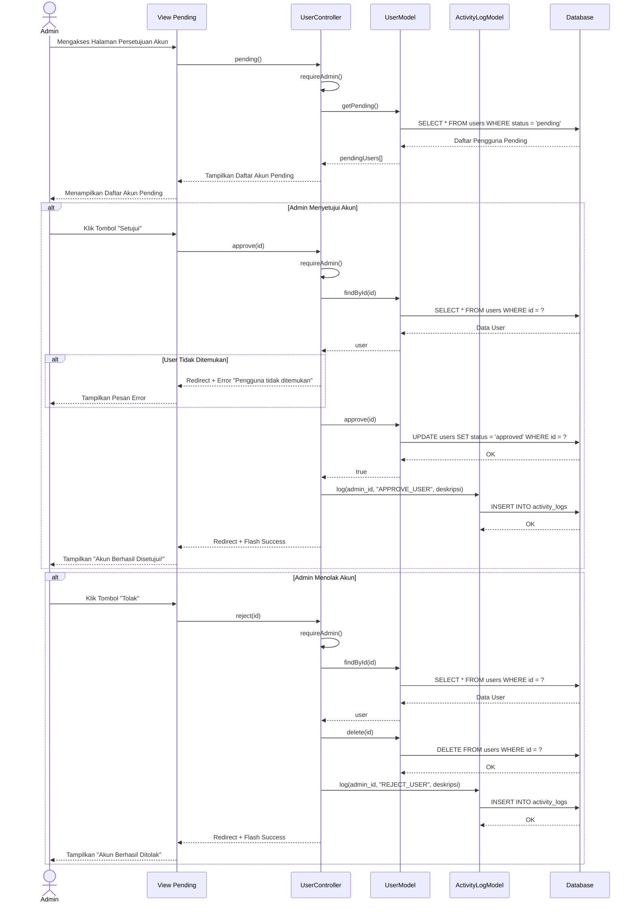
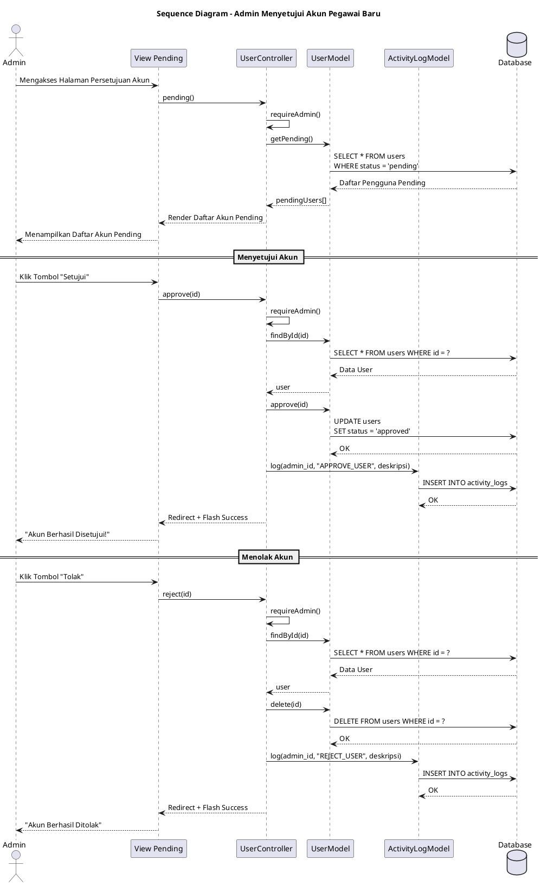
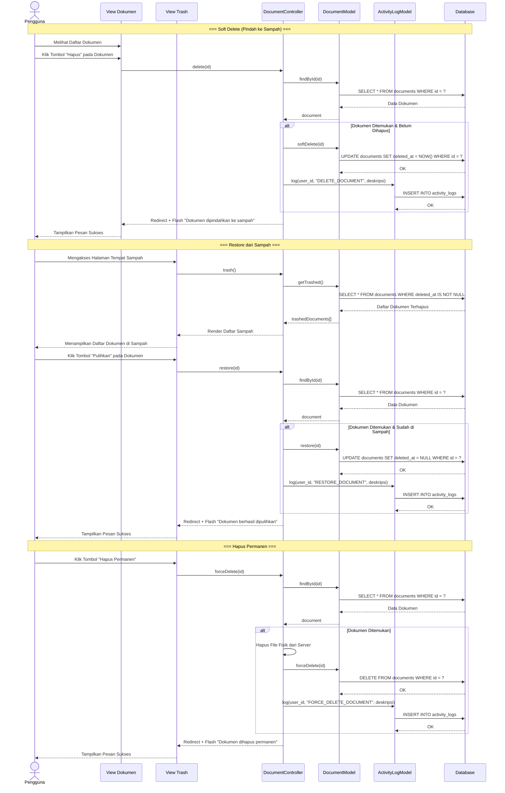
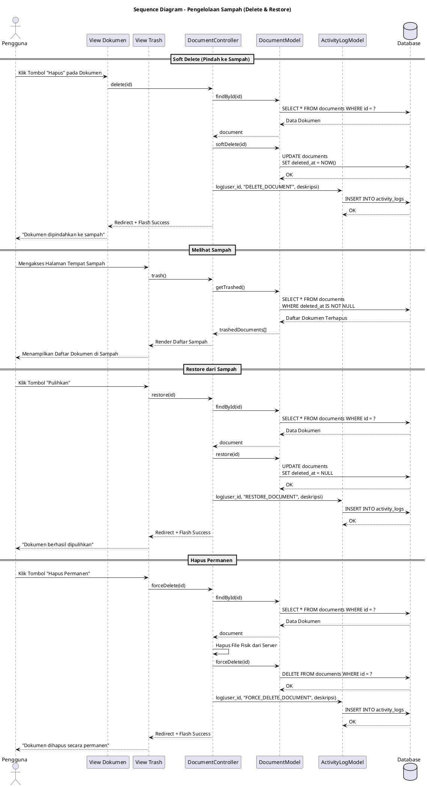
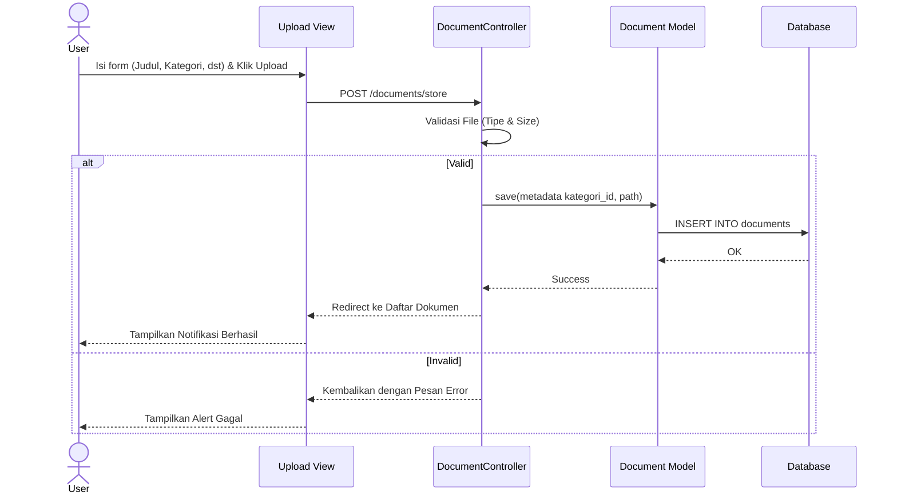
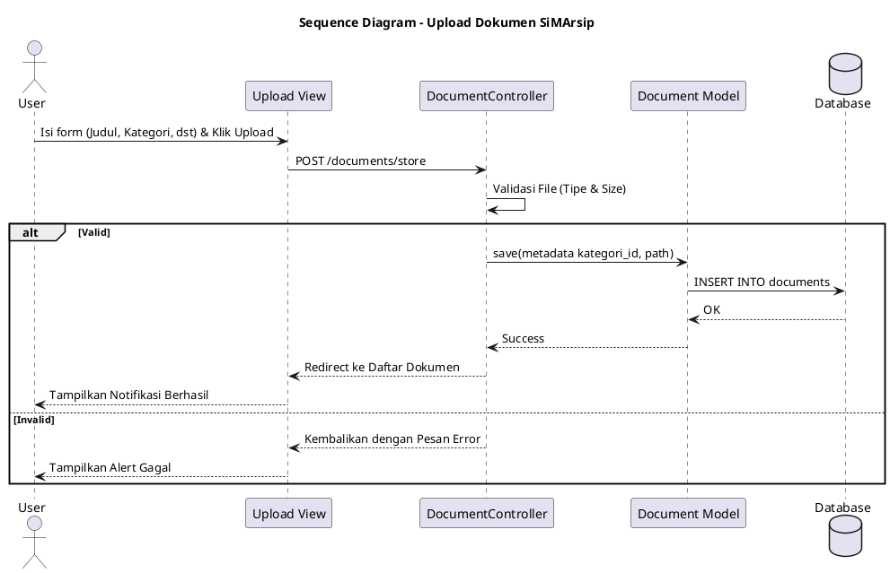

# Sequence Diagram - SiMArsip

## 1. Sequence Diagram: Login



### PlantUML: Login



---

## 2. Sequence Diagram: Registrasi



### PlantUML: Registrasi



---

## 3. Sequence Diagram: Proses Admin Menyetujui Akun Pegawai Baru



### PlantUML: Proses Admin Menyetujui Akun



---

## 4. Sequence Diagram: Pengelolaan Sampah (Delete & Restore)



### PlantUML: Pengelolaan Sampah



---

## 5. Sequence Diagram: Melihat Log Aktivitas (Admin)
*Halaman Khusus Manajemen Log*

```mermaid
sequenceDiagram
    actor A as Admin
    participant V as View Activity Log
    participant ALC as ActivityLogController
    participant LM as ActivityLogModel
    participant DB as Database

    A->>V: Mengakses Menu Log Aktivitas
    V->>ALC: index()

    ALC->>ALC: requireAdmin()
    
    ALC->>LM: getAll(perPage, offset)
    LM->>DB: SELECT * FROM activity_logs ...
    DB-->>LM: Data Log Semua User
    LM-->>ALC: logs[]

    ALC->>LM: countAll()
    LM->>DB: SELECT COUNT(*) ...
    DB-->>LM: Total Log
    LM-->>ALC: total

@enduml
```

---

## 6. Sequence Diagram: Upload Dokumen



### PlantUML: Upload Dokumen



