# System Design Documentation - Archive Management System (bri_arsip)

Dokumen ini memberikan gambaran komprehensif tentang arsitektur dan desain **Sistem Manajemen Arsip**. Diagram ini merepresentasikan sistem dalam bentuk yang lengkap secara fungsionalitas dan teknis.

---

## 1. Use Case Diagram
Menggambarkan fungsi sistem dan interaksi aktor (**Administrator** & **Pegawai**).

```mermaid
useCaseDiagram
    actor "Administrator" as Admin
    actor "Pegawai" as Pegawai
    
    package "Sistem Manajemen Arsip" {
        usecase "Login / Logout" as UC1
        usecase "Register Akun" as UC2
        usecase "Upload Dokumen" as UC4
        usecase "Cari & Lihat Dokumen" as UC5
        usecase "Edit / Hapus Dokumen" as UC6
        usecase "Approve / Blokir User" as UC8
        usecase "Kelola Sampah (Restore/Hapus)" as UC9
        usecase "Lihat Activity Logs" as UC10
    }
    
    Pegawai --> UC1
    Pegawai --> UC2
    Pegawai --> UC4
    Pegawai --> UC5
    Pegawai --> UC6
    Pegawai --> UC10
    
    Admin --> UC1
    Admin --> UC4
    Admin --> UC5
    Admin --> UC6
    Admin --> UC8
    Admin --> UC9
    Admin --> UC10
```

---

## 2. Activity Diagram

### A. Login
Menjelaskan alur masuk ke sistem dengan validasi keamanan dan rate limiting.

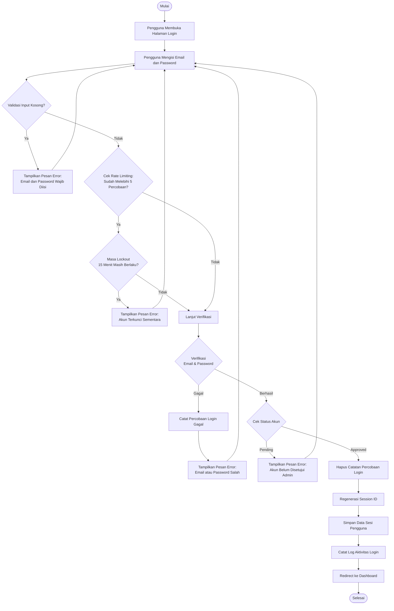

### B. Registrasi
Alur pendaftaran akun baru bagi pegawai.

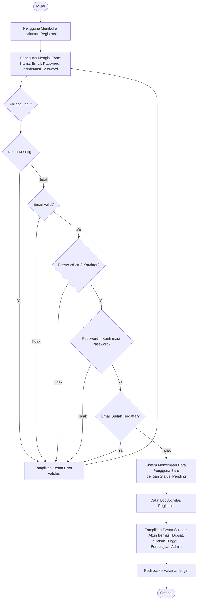

### C. Melihat Log Aktivitas (Admin)
Admin mengakses halaman khusus log dengan semua data seluruh pengguna.

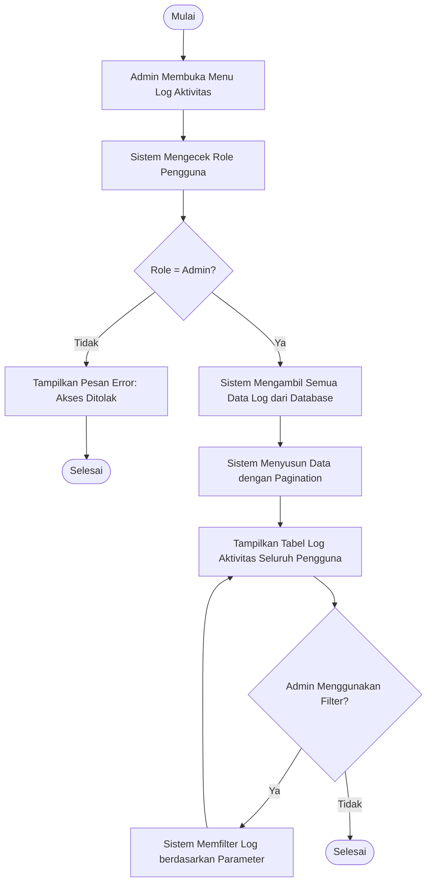

### D. Melihat Log Aktivitas (Pegawai)
Pegawai hanya melihat aktivitasnya sendiri di bagian Recent Activity pada Dashboard.

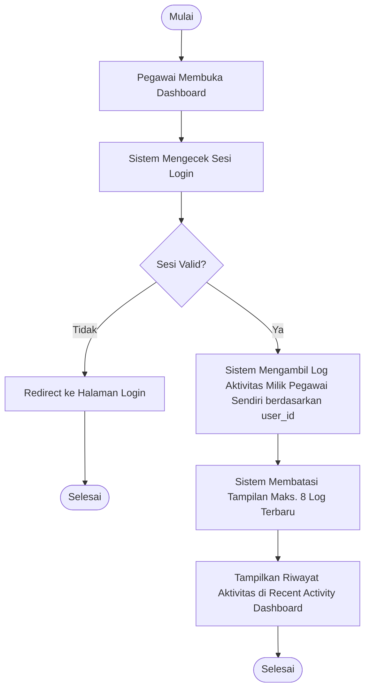

---

## 3. Class Diagram
Struktur MVC (Model-View-Controller) sistem.

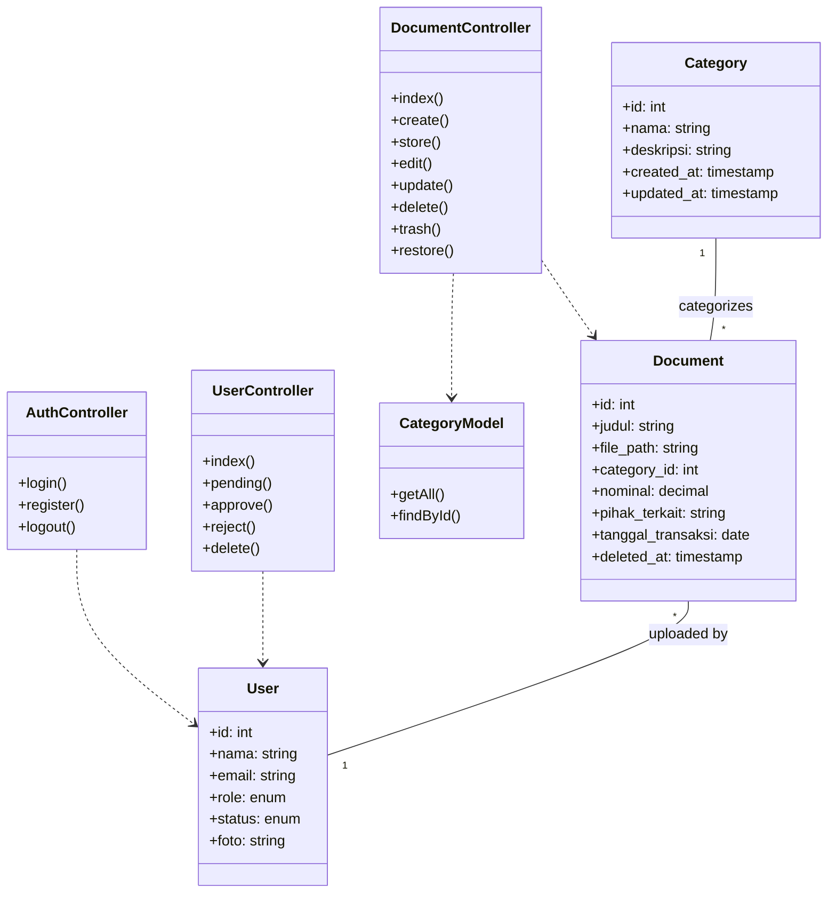

---

## 4. Sequence Diagram

### A. Login
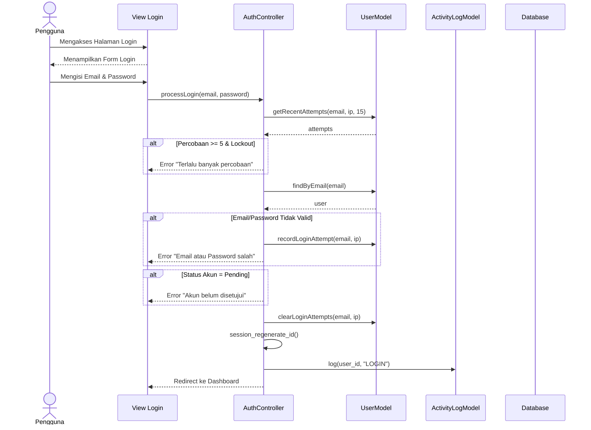

### B. Registrasi
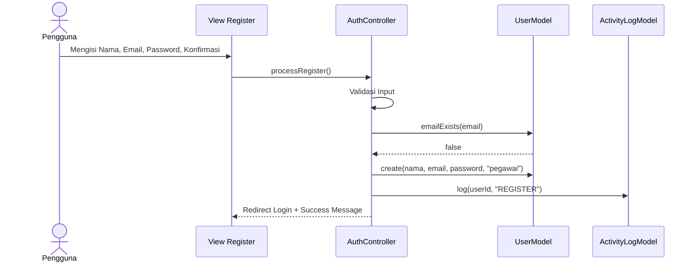

### C. Admin Menyetujui Akun Pegawai
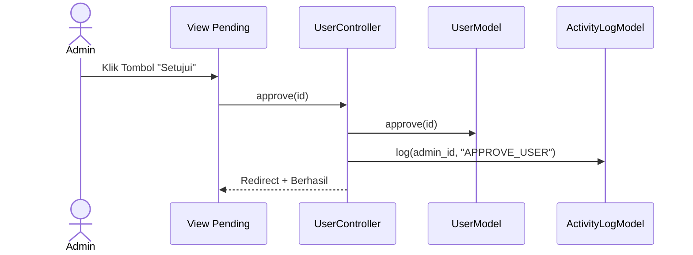

### D. Pengelolaan Sampah (Delete & Restore)
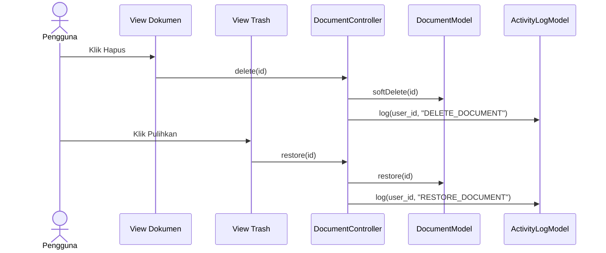

### E. Melihat Log Aktivitas

**1. Skenario Admin (Halaman Khusus)**
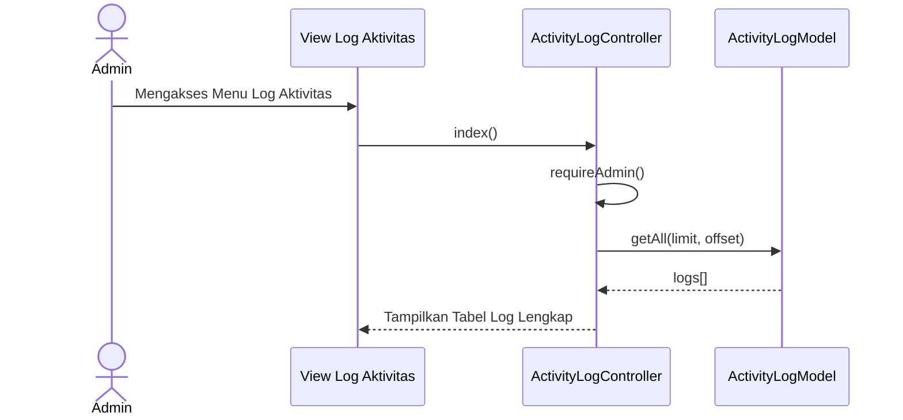

**2. Skenario Pegawai (Halaman Dashboard)**
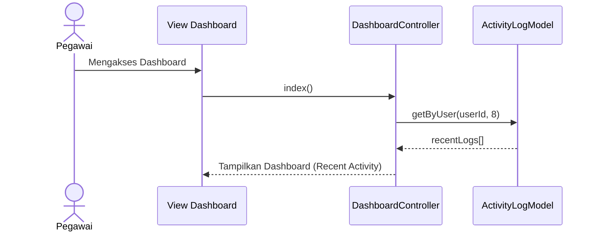

---

## 5. Program Flowchart
Alur logika eksekusi aplikasi dari `index.php`.

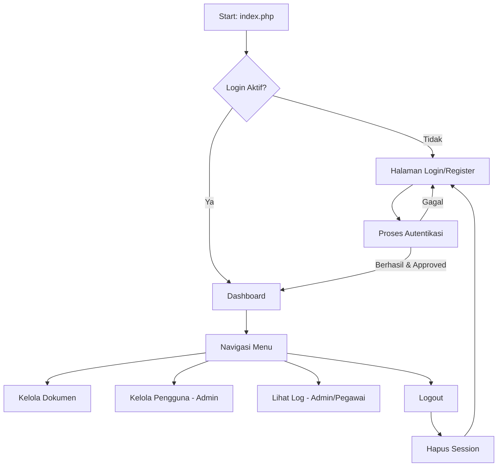

---

## 6. Entity Relationship Diagram (ERD)
Struktur database tabel-tabel utama sesuai `schema.sql`.

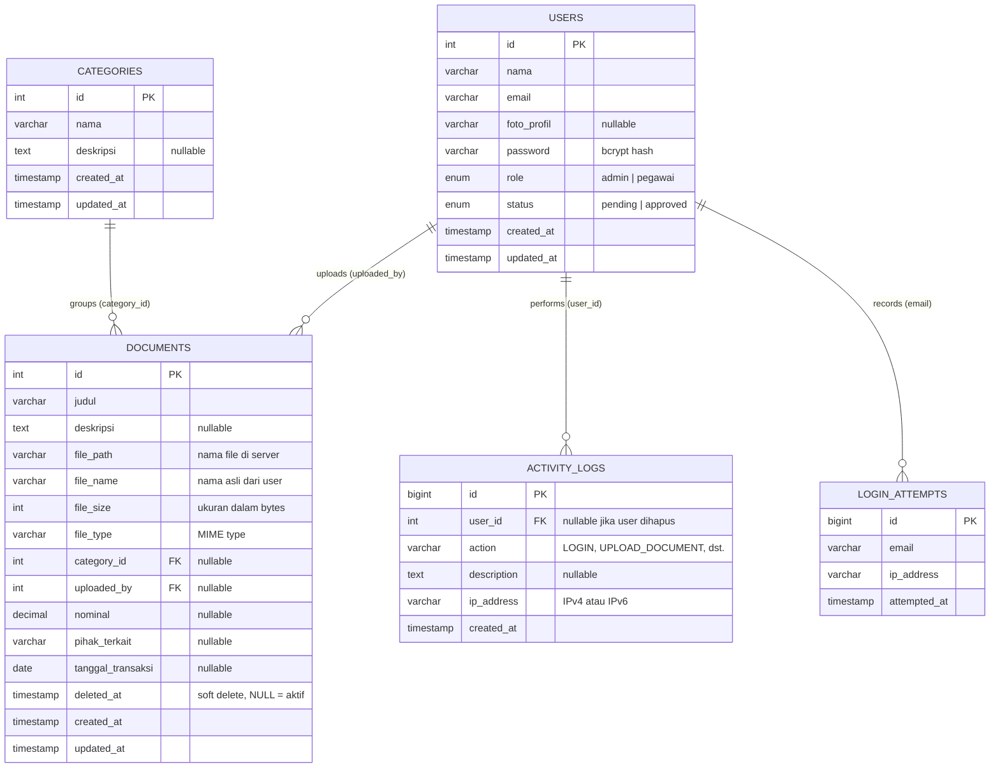

---

## 7. Data Flow Diagram (DFD) Level 0

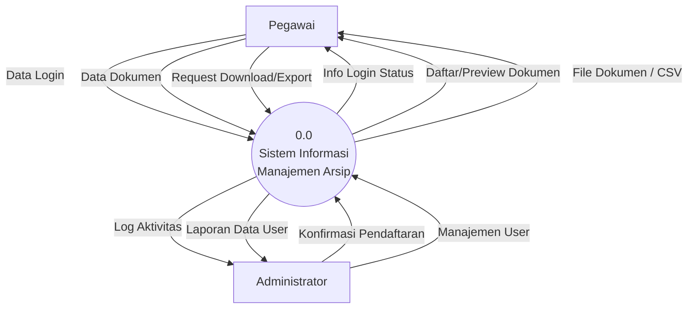

---

## 8. Data Flow Diagram (DFD) Level 1

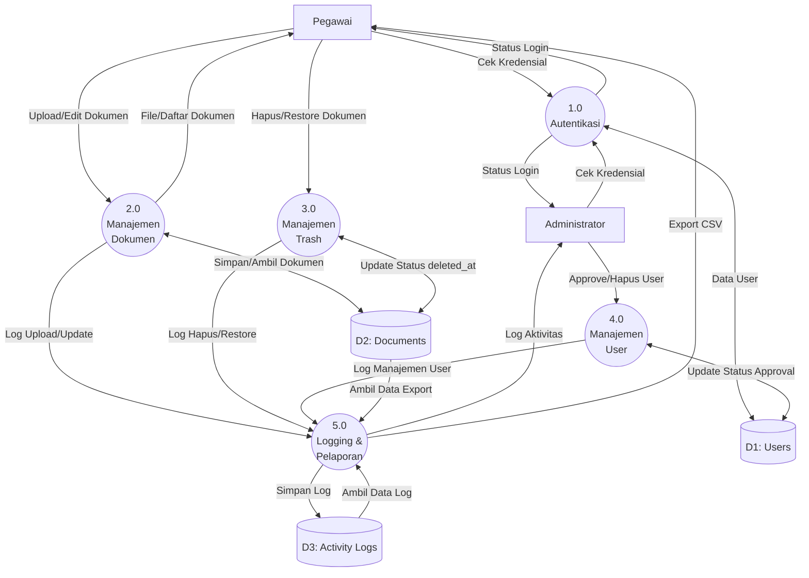
