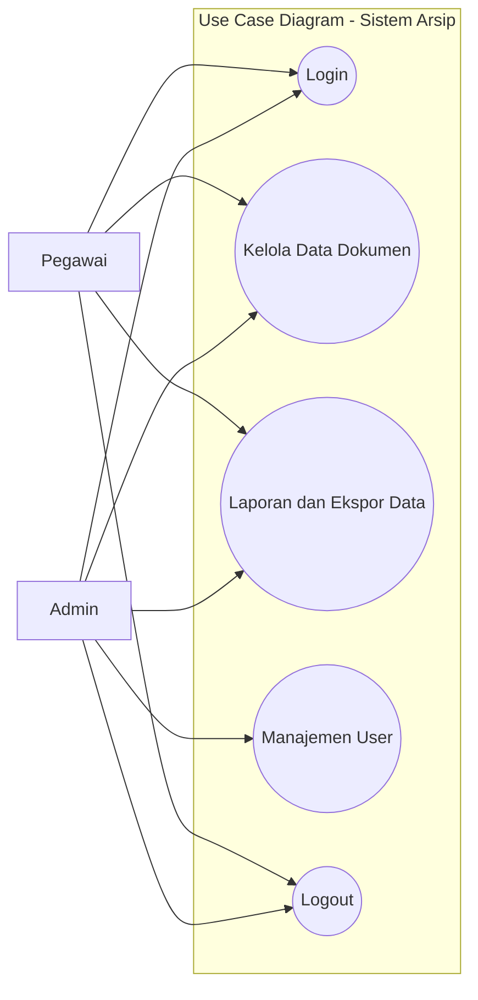
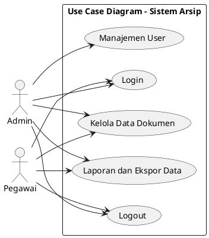

# Use Case Diagram Ringkas - SiMArsip

Versi ini disederhanakan seperti contoh gambar: fokus ke fitur utama.

## Mermaid (ringkas)

```mermaid
flowchart LR
    A[Admin]
    P[Pegawai]

    subgraph S["Use Case Diagram - Sistem Arsip"]
        U1((Login))
        U2((Kelola Data Dokumen))
        U3((Laporan dan Ekspor Data))
        U4((Manajemen User))
        U5((Logout))
    end

    A --> U1
    P --> U1

    A --> U2
    P --> U2

    A --> U3
    P --> U3

    A --> U4

    A --> U5
    P --> U5
```

## PlantUML (ringkas)

```plantuml
@startuml
left to right direction
skinparam packageStyle rectangle

actor Admin
actor Pegawai

rectangle "Use Case Diagram - Sistem Arsip" {
  usecase "Login" as UC1
  usecase "Kelola Data Dokumen" as UC2
  usecase "Laporan dan Ekspor Data" as UC3
  usecase "Manajemen User" as UC4
  usecase "Logout" as UC5
}

Admin --> UC1
Pegawai --> UC1

Admin --> UC2
Pegawai --> UC2

Admin --> UC3
Pegawai --> UC3

Admin --> UC4

Admin --> UC5
Pegawai --> UC5
@enduml
```

